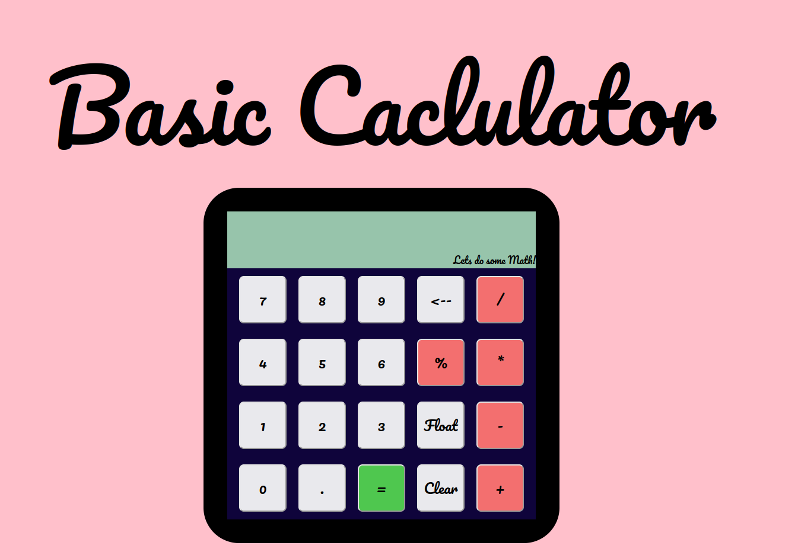

Basic Calculator

This is a simple calculator application built using HTML, CSS, and JavaScript. It performs basic arithmetic operations such as addition, subtraction, multiplication, and division on two numbers. It also includes a feature to display the result as a floating-point number with two decimal places.

Features

    Addition of two numbers
    Subtraction of two numbers
    Multiplication of two numbers
    Division of two numbers
    Displaying the result as a floating-point number with two decimal places

How to Use

    Clone this repository to your local machine.
    Open the index.html file in your web browser.
    Enter the two numbers you want to perform arithmetic operations on.
    Select the operation you want to perform by clicking on the corresponding button.
    The result of the operation will be displayed on the screen.
    To display the result as a floating-point number with two decimal places, click the "Float Answer" button.
    To clear the calculator, click the "Clear" button.
    To remove the last entered digit or operator, click the "Backspace" button.

